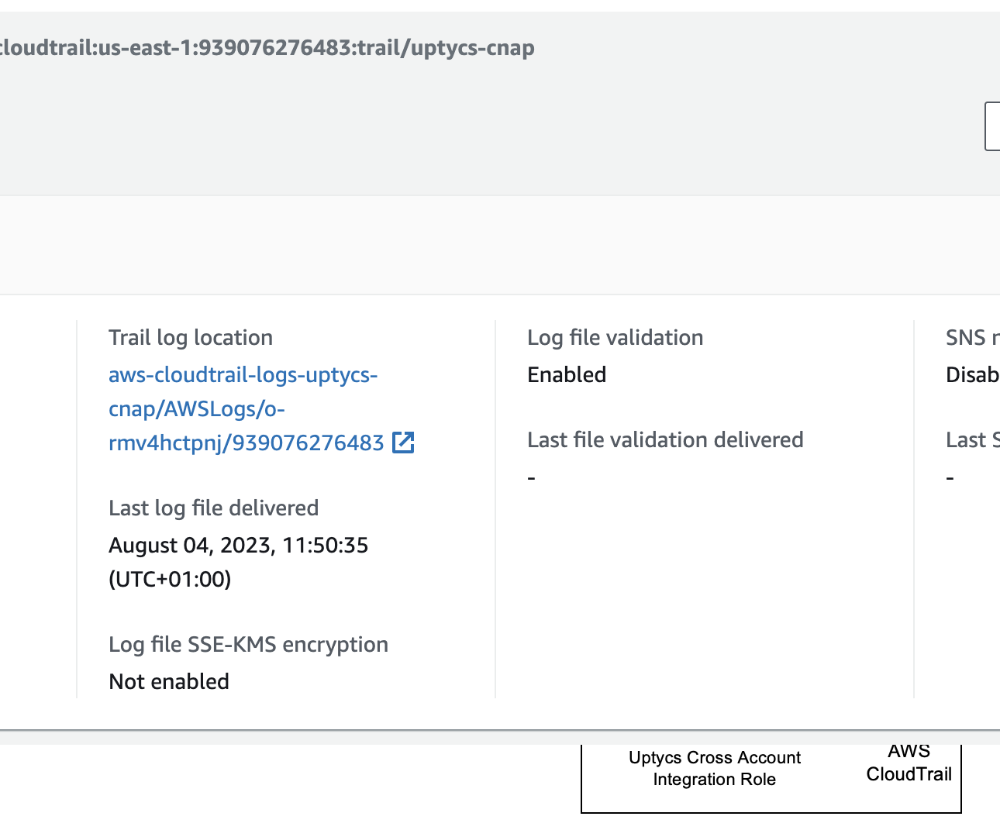

<!-- TOC -->
* [AWS Integration](#aws-integration)
* [How Cloud Integration Works](#how-cloud-integration-works)
  * [Data Collection](#data-collection)
  * [Standalone Account](#standalone-account)
  * [Organizations](#organizations)
    * [Master Account](#master-account)
    * [Log Aggregation Account](#log-aggregation-account)
    * [Member Accounts](#member-accounts)
* [KMS Encryption](#kms-encryption)
<!-- TOC -->

# AWS Integration

A Collection of documentation, scripts and templates to help with AWS Integration


# How Cloud Integration Works

Cloud Integration will gather information from your AWS accounts and analyse the account for 
misconfigured resources that pose a security risk and for suspicious activity.

Upytcs will leverage an IAM role in the account in order to gather information via CloudTrail 
and the AWS API.

An example of the IAM role created is included [here](./templates/org-member-acct-iam-role.yaml).

> NOTE:  If your cloudtrail logs are encrypted using SSE-KMS encryption the role will also 
> require access to the KMS key used to encrypt the logs. 

More information [here](#kms-encryption)

## Data Collection

**Step 1: AWS writes logs to a CloudTrail bucket**

AWS will send logs to a CloudTrail bucket in the same account.  The trail can be a dedicated 
trail or a trail used by your existing services.   The trail should contain **Management** 
events at a minimum but does **NOT** require **KMS** or **Data events**.

> NOTE: Additional trails are chargeable, KMS events add considerably to the volume of CloudTrail 
> events created so if you are creating a dedicated trail for Uptycs you can exclude KMS events 
> to save costs.   


**Step 2: Uptycs Reads Logs from the S3 Bucket.**

Every X hours Uptycs will retrieve logs from the S3 bucket and parse the log files. The logs 
files are expected to be in the following location. 
```<bucket>/AWSLogs/<accountId>/CloudTrail/<region>```


**Step 3: Uptycs parses the log files**

The log files are parsed and analysed for suspicious behaviour.  Relevant alerts are generated.  
If new resources are detected Uptycs will use the AWS api to query the current state of the 
resource. 

**Step 4: Uptycs Queries Resource Configuration**

Uptycs assumes the role in the customer account and calls Describe:*, list:* for the services 
that it is monitoring

## Standalone Account

For single AWS accounts Uptycs require an IAM role that grants read only access to the services 
to be monitored and to cloudtrail logs in a S3 bucket in the **same** account. An example policy can be found [here](./templates/org-member-acct-iam-role.yaml)


## Organizations

For AWS organization accounts Uptycs require an IAM role that grants read only access to the 
services 
to be monitored and to cloudtrail logs in a **dedicated** cloudtrail logging account.  It is 
expected that each member account will have a individual cloudtrail writing to the consolidated 
logging account or an organization wide trail writing to a logging account. 




### Master Account

The master account requires an IAM role the grants access to monitored AWS resources and Read 
access to the AWS Organization . An example policy can be found [here](.
/templates/org-member-acct-iam-role.json)


### Log Aggregation Account

The logging account requires an IAM role the grants access to monitored AWS resources and to the 
S3 bucket containing the cloudtrail logs. An example policy can be found [here](./templates/org-log-acct-iam-role.json)

### Member Accounts

Each member requires an IAM role the grants access to monitored AWS resources. An example 
policy can be found [here](./templates/org-member-acct-iam-role.yaml)


# KMS Encryption
To update the KMS key policy to allow the IAM role "UptycsIntegrationRole" 
access for decrypting CloudTrail logs, navigate to the AWS Key Management Service (KMS) in the 
AWS Management Console. Locate the KMS key used for encrypting the CloudTrail logs and click on it. 
In the "Key policy" section, edit the policy, and add a statement granting "UptycsIntegrationRole" 
the "kms:Decrypt" permission. Ensure the statement includes a resource block with the specific 
ARN of the KMS key. This modification will enable the "UptycsIntegrationRole" 
IAM role to use the KMS key for decryption purposes, allowing it to access and read the 
encrypted CloudTrail logs.


For example the following can be added to the existing KMS key policy to explicitly grant the 
Uptycs IAM role decrypt permissions.
```text
{
  "Version": "2012-10-17",
  "Id": "key-policy-for-cloudtrail",
  "Statement": [
    {
      "Sid": "Allow CloudTrail decryption",
      "Effect": "Allow",
      "Principal": {
        "AWS": "arn:aws:iam::<account-id>:role/UptycsIntegrationRole"
      },
      "Action": "kms:Decrypt",
      "Resource": "arn:aws:kms:<region>:<account-id>:key/<kms-key-id>"
    }
  ]
}

```


