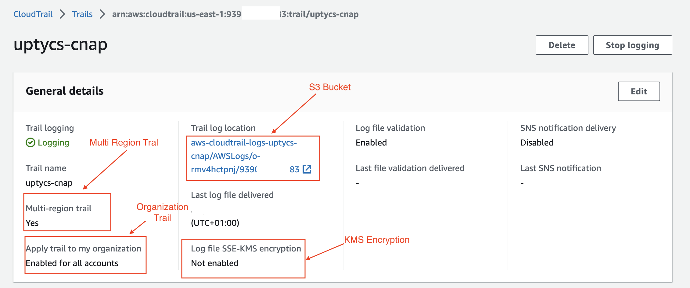
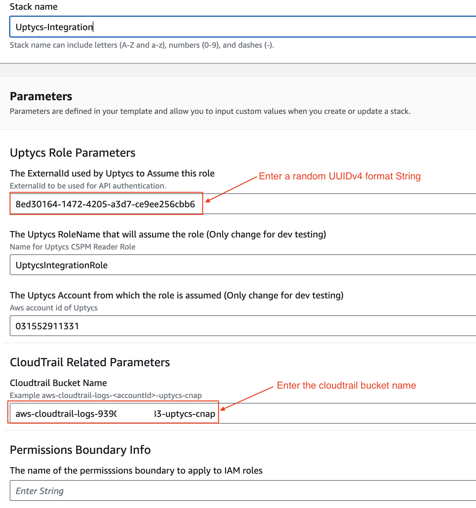
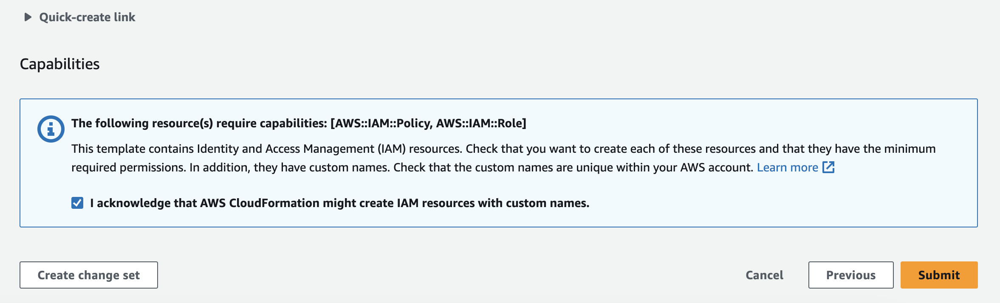
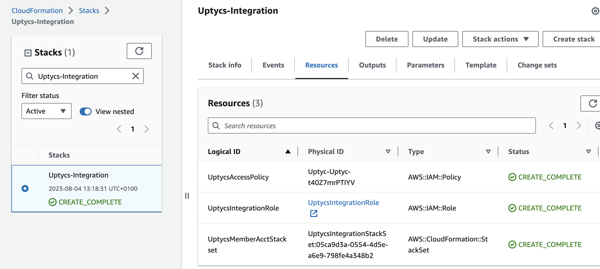
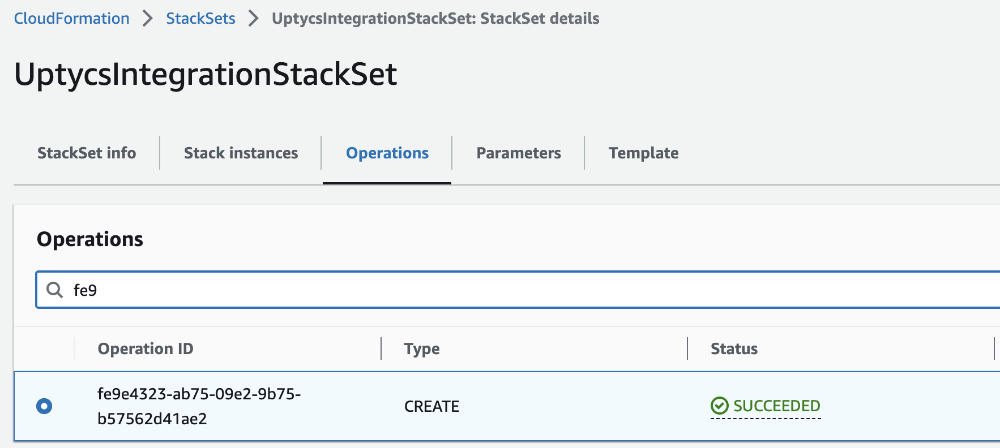
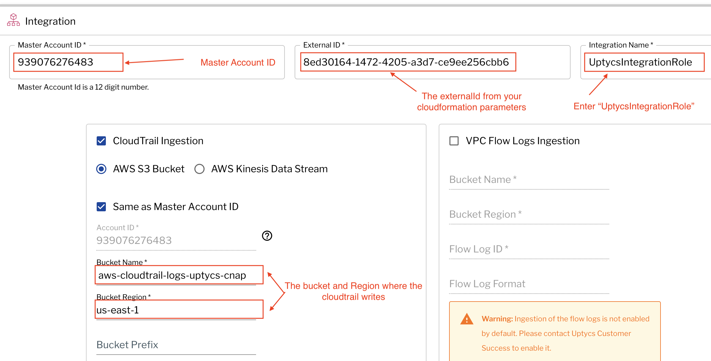
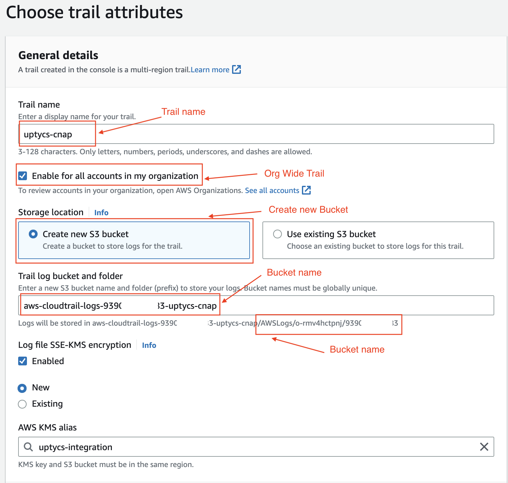
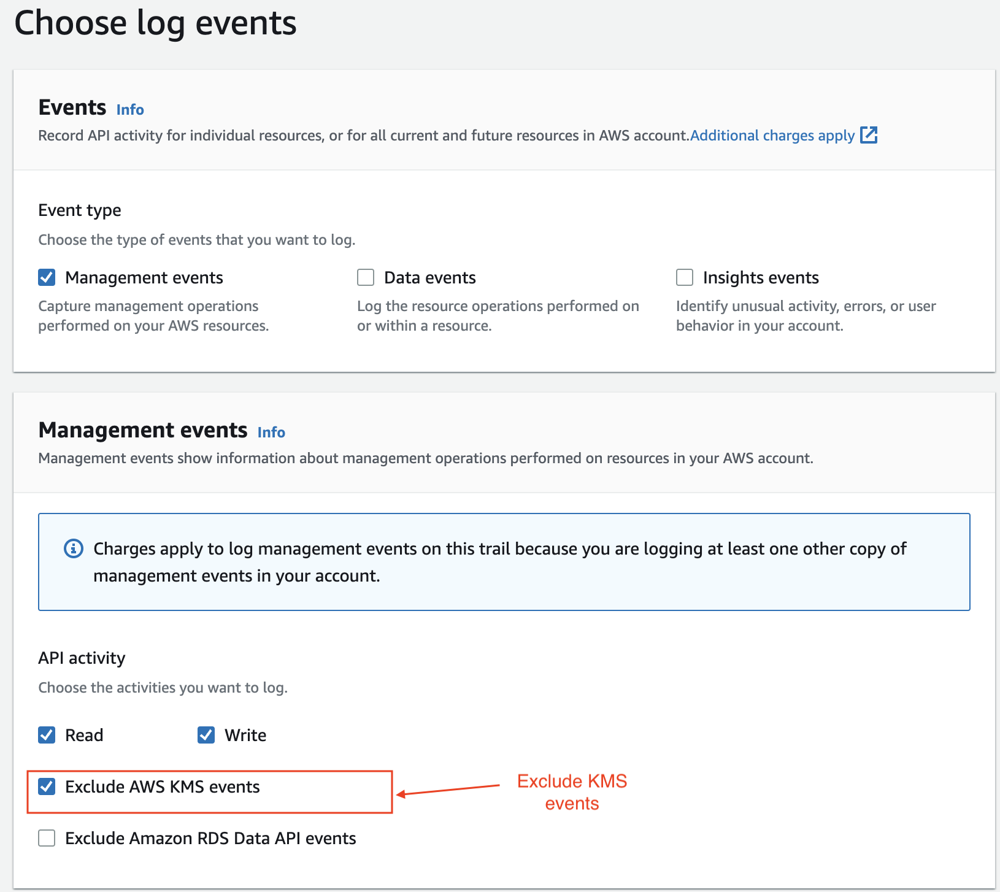

# Organization Setup

This document describes how to setup your Uptycs Integration in an AWS organization where you 
wish to control the 

# Setup Procedure

## Clone the repository to you local system


```git clone https://github.com/jharris-uptycs/aws-integration-tools.git```


## 1) Setup CloudTrail in the Master account

Uptycs requires access to CloudTrail logs from each of your accounts to monitor for suspicious 
activity

First Check that you have a suitable "Organization Wide" trail in the master account. 



Verify the following 

* Multi-region trail: Yes
* Apply trail to my organization: Enabled for all accounts

Note these values as you will need them as parameters for the cloudformation template

* S3 Bucket containing the logs
* Path to the Log files
* KMS Encryption

If you do not have a suitable trail in the master account then create a trail following the 
procedure Creating a new Trail

## 2) Load the CloudFormation template "org-setup.yaml"

Generate a random UUIDv4 string.   https://www.uuidgenerator.net/version4 or https://www.uuidtools.com/v4

### Load the cloudformation template.
> Note: Do not alter default values unless asked to do so




Add the ExternalId
Add the CloudTrail Bucket Name
If you use permissions boundarys enter the policy name otherwise leave blank

### Accept default settings on the following pages and acknowlege

* Acknowlege that you are creating an IAM role



### Verify that the stack completes



### Apply Stack Instances to Accounts

Navigate to **Cloudformation -> Stacksets**

* Select **Add stacks to StackSet**
* Select **Add to OU or Org**
* Enter the **OU or Org**
* Enter the region where your stack and cloudtrail exists

You should observe that the operation has succeeded




## 3) Register the Org in the Uptycs Console

Go the the accounts integration page and select "AWS Organization"



Enter the following
* Master Account ID (10 Digit account number of the master account)
* ExternalId (The UUIDv4 random string you entered in the cloudformation parameters)
* The Cloudtrail bucket name and region

You should now see the org in the organization pane

# Creating a new Trail

Create a trail 




* Enter the Trail name
* Select "Enable for all accounts in my organization"
* Select "Create new S3 bucket"
* Note the S3 bucket name and the path to the log files
* Optionally select "Log file SSE-KMS encryption" + "New"


Page - 2




* Select Exclude AWS KMS events


